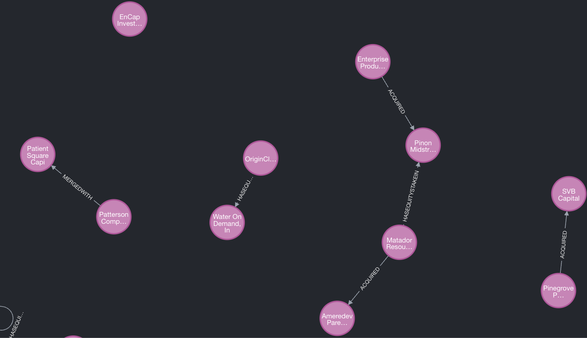

# Financial Knowledge Graphs

A toolset for extracting financial knowledge from text and building queryable knowledge graphs in Neo4j.

## Overview

Financial Knowledge Graphs leverages Large Language Models (LLMs) to extract structured financial knowledge from unstructured news articles. The extracted information is stored in a Neo4j graph database, creating a queryable knowledge graph of financial entities and their relationships.



## Features

- **Knowledge Extraction**: Extract structured financial information from unstructured text using LLMs, including company entities (name, ticker, industry, country) and key financial relationships (acquisitions, mergers, debt, equity stakes)
- **Knowledge Graph Creation**: Store extracted entities and relationships in Neo4j for querying and analysis using a domain-specific financial ontology
- **Flexible LLM Integration**: Support for OpenAI GPT models and local LLMs (Llama3 8B) via Ollama - see [Ollama Setup Guide](docs/ollama_setup.md)
- **Advanced Evaluation**: Compare extraction results against high-quality ground truth from multiple sources (synthetic examples and expert LLM-generated ground truth)
- **Batch Processing**: Process large datasets efficiently with OpenAI's Batch API (50% cost savings), with intelligent dataset splitting and duplicate avoidance
- **Financial Ontology**: Clear schema for financial entities and relationships - see [Ontology Guide](docs/ontology.md)

## Installation

> **Prerequisites**: This project requires [uv](https://github.com/astral-sh/uv) for dependency management. Make sure it's installed before proceeding.

1. Clone the repository:

   ```bash
   git clone https://github.com/yourusername/financial-knowledge-graphs.git
   cd financial-knowledge-graphs
   ```

2. Create a virtual environment and install dependencies:

   ```bash
   uv sync
   ```

3. Set up your environment variables in a `.env` file:

   ```
   OPENAI_API_KEY=your_openai_api_key
   ```

4. Start Neo4j (using Docker):
   ```bash
   docker run -d --name neo4j -p 7474:7474 -p 7687:7687 -e NEO4J_AUTH=neo4j/password neo4j
   ```

## Usage

All functionality is accessible through a unified command interface:

```bash
# Extract financial knowledge with LLMs
python -m src.main llm

# Evaluate extraction results
python -m src.main evaluate

# Neo4j database operations (import from execution batch results)
python -m src.main neo4j <execution_id>

# Retrieve batch processing results
python -m src.main batch <batch_id> [options]
```

The application is configured through YAML files in the `configs` directory. For detailed configuration options and advanced usage, refer to the [Execution Configuration Guide](docs/execution_configs.md).

## Project Structure

```
├── configs/                   # Configuration files
├── data/                      # Data directory
│   ├── batch_processing/      # Batch processing files
│   ├── ground_truth/          # Ground truth data
│   ├── processed/             # Processed data
│   └── raw/                   # Raw input data
├── docs/                      # Documentation
├── src/                       # Source code
│   ├── db/                    # Database handlers
│   ├── llm/                   # LLM integration
│   ├── runners/               # Task runners
│   ├── utils/                 # Utility functions
│   └── main.py                # Main entry point
```
